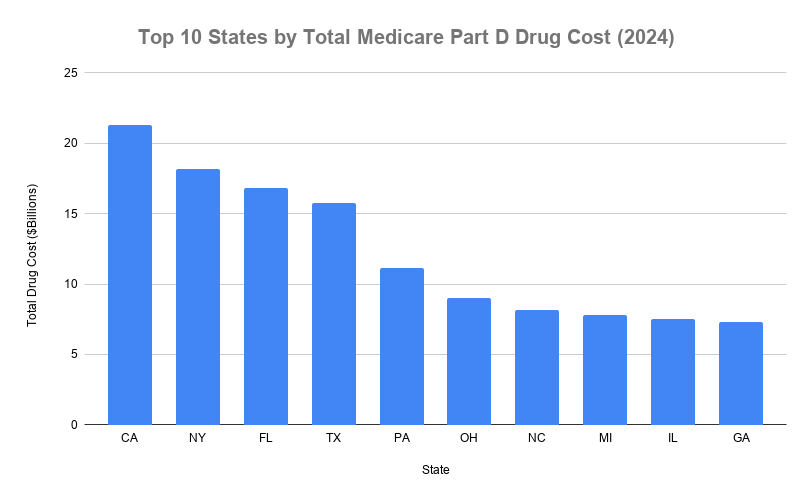
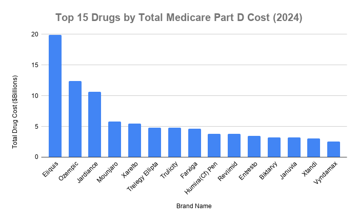
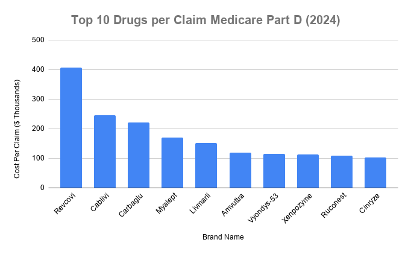
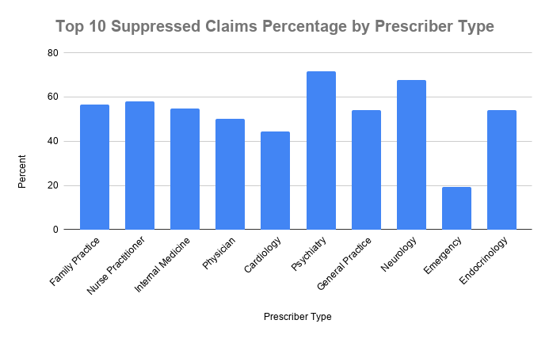

# Pharmacy Claims Analysis (CMS Medicare Part D)

## Overview
Exploring 2024 CMS Medicare Part D prescriber and drug claims data using SQL, with a focus on cost-per-claim trends and beneficiary count patterns. This project is part of a self-directed transition from pharmacy practice into healthcare data analytics.

## Data Source
CMS Medicare Part D Prescribers - by Provider and Drug (2024)
https://data.cms.gov/provider-summary-by-type-of-service/medicare-part-d-prescribers/medicare-part-d-prescribers-by-provider-and-drug

Raw file:  ~4GB CSV, 28M+ rows. Not included in this repo due to size.

## Tools
- SQL (SQLite via DB Browser for SQLite)
- Google Sheets

## Setup
1. Download the CSV from the CMS link above.
2. Load into a SQLite database (schema in 'queries.sql')
3. Table name used in this project:  'claims'
4. Export CSV from DB Browser to Google Sheets
5. Create 4 different graphs (visualizations) depicting analysis findings.

## Analysis Summary
After conducting several exploratory analyses to get familiar with the data and its limitations, there were four primary points focused on:

1. The 10 states with the most Medicare Part D spending.
2. The 15 drugs with the highest total Medicare Part D spending.
3. The 10 drugs with the highest cost per individual claim.
4. The 10 specialties with the most claims, showing their respective percent of total claims that are withheld per CMS standards to avoid HIPAA violations.

## Notes
This project involved rebuilding the database from scratch after an early tooling issue caused data loss.  The current schema was hand written as a result.

Additionally, during export of the CSV queries, DB Browser kept crashing and closing with no error message. DB Browser was subsequently run from the terminal rather than GUI to see if any output of errors were printed. The terminal showed 'killed', which was determined to be an out of memory killer. I checked free -h and found that my system only had 1.4GB of RAM available. Rather than using the GUI, I had Claude help me use the sqlite3 command-line tool, which streamed the query directly to a CSV file.

## Key Findings
### Top 10 States by Total Medicare Part D Drug Cost (2024)
For user readability, I focused on the top 10 states where the total sum of Medicare Part D spending is taking place, and grouped it by each state to see how much each was spending. The four states with the most spending include California, New York, Florida, and Texas, which also happen to be the most populous states. These states each spent between $15 to $22 billion in Medicare Part D drug costs for the year 2024.

### Top 15 Drugs by Total Medicare Part D Cost (2024)
I arbitrarily chose the top 15 drugs with the highest total Medicare Part D spending.  This analysis was done by grouping all of the brand name drugs, getting the sum of the cost for each brand name medication, and ordering them in descending order to see what medications were costliest, irrespective of how many claims there were per medication. This allowed us to see which brand name medications Medicare Part D spent the most on. The top 3 medications in this category included Eliquis, Ozempic, and Jardiance, respectively, with Eliquis costing just under $20 billion for 2024. All of the medications that were in the top 15 are therapies used for chronic conditions in a large portion of the 65+ population, namely cardiovascular and diabetes/GLP-1 therapies, which is expected. 

### Top 10 Drugs per Claim Medicare Part D Cost (2024)
For this analysis, I also arbitrarily chose the 10 drugs that were the highest cost per individual claim.  In order to do this, I grouped all of the brand name drugs together, took the sum of the cost of all claims for each brand name drug, and divided that by the total number of claims for each drug, resulting in the cost per claim. The results were then displayed in descending order, giving me the costliest medications that Medicare Part D paid for. All of the medications on this list are newer medications, that are used for rare disease states and specialized therapies.  Revcovi, Cablivi, Carbaglu, and Myalept were the four medications that were costliest, with Revcovi topping the list at just over $400,000 per claim.

### Top 10 Suppressed Claims Percentage by Prescriber Type
In order to protect patients' privacy, as this is a public database, CMS has withheld the number of total claims per prescriber, per medication, if there are 10 or fewer patients in that respective record. For this analysis, I grouped by prescriber type (specialty or field of practice), counted the number of records where the total claims value was withheld (ie - they had 10 or fewer patients that had processed a claim on a medication). The total number of claims was calculated for each prescriber type and the percentage of suppressed claims was calculated, based on prescriber type.  The values were displayed in descending order based on the total number of claims, so those with the most amount of claims were ranked, in order to see what percentage had their total claims value withheld. Emergency medicine, which sees a broad range of disease states and patients, had the lowest suppression rate among the top 10, with just under 20% of all claims having their total claims value suppressed.

## Future Direction
When looking at the states with the most Medicare Part D spending, it would also be interesting to look at the percent that each state spends, as a function of the total amount spent each year.  Since we already know the states with the most spending, it would be interesting to see what percentage each state spends, when compared to all states.